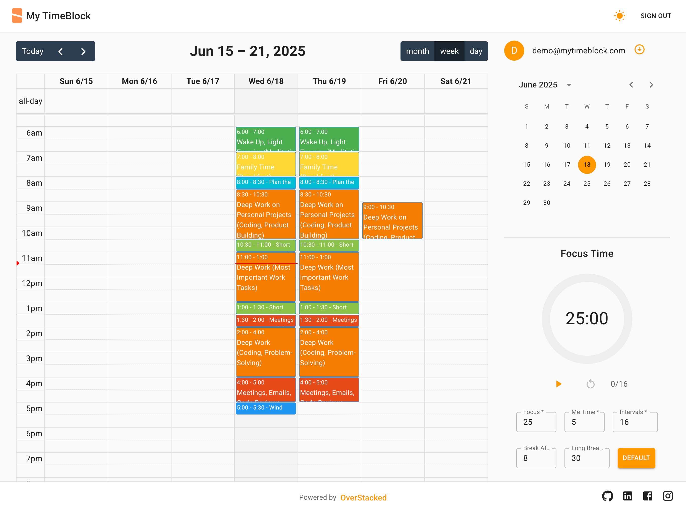

# mytimeblock.com

A modern calendar application built with React, TypeScript, Material-UI and firebase that helps users efficiently manage their time and schedule events. Features include:

- Interactive calendar views (month, week, day)
- Drag-and-drop event management
- Custom color picker for event categorization
- Real-time updates and persistence
- Responsive design for all devices
- Firebase authentication and data storage

<p>
  
</p>

Try it live at [mytimeblock.com](https://mytimeblock.com)

## React + TypeScript + Vite

This template provides a minimal setup to get React working in Vite with HMR and some ESLint rules.

Currently, two official plugins are available:

- [@vitejs/plugin-react](https://github.com/vitejs/vite-plugin-react/blob/main/packages/plugin-react/README.md) uses [Babel](https://babeljs.io/) for Fast Refresh
- [@vitejs/plugin-react-swc](https://github.com/vitejs/vite-plugin-react-swc) uses [SWC](https://swc.rs/) for Fast Refresh

## Expanding the ESLint configuration

If you are developing a production application, we recommend updating the configuration to enable type aware lint rules:

- Configure the top-level `parserOptions` property like this:

```js
export default tseslint.config({
  languageOptions: {
    // other options...
    parserOptions: {
      project: ["./tsconfig.node.json", "./tsconfig.app.json"],
      tsconfigRootDir: import.meta.dirname,
    },
  },
});
```

- Replace `tseslint.configs.recommended` to `tseslint.configs.recommendedTypeChecked` or `tseslint.configs.strictTypeChecked`
- Optionally add `...tseslint.configs.stylisticTypeChecked`
- Install [eslint-plugin-react](https://github.com/jsx-eslint/eslint-plugin-react) and update the config:

```js
// eslint.config.js
import react from "eslint-plugin-react";

export default tseslint.config({
  // Set the react version
  settings: { react: { version: "18.3" } },
  plugins: {
    // Add the react plugin
    react,
  },
  rules: {
    // other rules...
    // Enable its recommended rules
    ...react.configs.recommended.rules,
    ...react.configs["jsx-runtime"].rules,
  },
});
```

## Running the application

```
$ yarn

$ yarn run dev
```

or

```
$ yarn

$ npx vite

{
  "scripts": {
    "dev": "vite", // start dev server, aliases: `vite dev`, `vite serve`
    "build": "vite build", // build for production
    "preview": "vite preview" // locally preview production build
  }
}

```

```
  VITE v5.4.8  ready in 484 ms

  ➜  Local:   http://localhost:5173/
  ➜  Network: use --host to expose
  ➜  press h + enter to show help
```

## Deploying to google firebase

```
$ yarn run build

$ firebase deploy
```

## Resources

[Official TypeScript Example](https://github.com/christopher-caldwell/react-big-calendar-demo)

[TypeScript Example](https://github.com/Mumma6/react-calendar-example)
